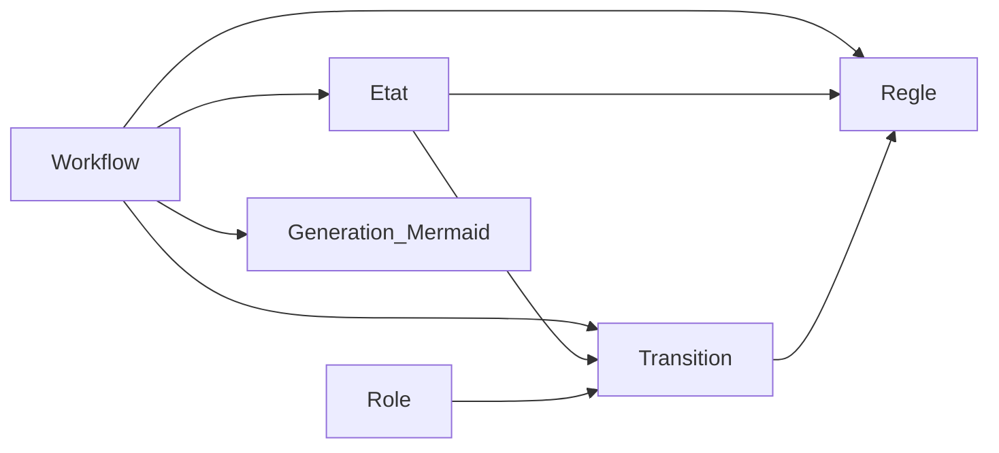

# Structure de la base de données

Cette page décrit le modèle de données utilisé pour représenter des workflows, générer des diagrammes Mermaid et documenter les états, transitions, règles et rôles associés.

Le modèle est volontairement compatible avec une base de type Grist : les tables sont simples, les identifiants sont lisibles et les relations peuvent être représentées par des références.

## Vue d'ensemble

## Table `Workflow`

La table `Workflow` décrit un processus métier ou un circuit de suivi.

| Champ | Type | Obligatoire | Description |
|---|---|---:|---|
| `workflow_id` | texte | oui | Identifiant stable du workflow. |
| `nom` | texte | oui | Nom lisible du workflow. |
| `description` | texte long | non | Description fonctionnelle du workflow. |
| `type_diagramme` | choix | oui | Type de génération Mermaid : `flowchart` ou `stateDiagram`. |
| `orientation` | choix | non | Orientation Mermaid : `TD`, `LR`, `BT`, `RL`. |
| `actif` | booléen | oui | Indique si le workflow est utilisable. |

## Table `Etat`

La table `Etat` décrit les états possibles d'un workflow.

| Champ | Type | Obligatoire | Description |
|---|---|---:|---|
| `etat_id` | texte | oui | Identifiant stable et compatible Mermaid. |
| `workflow_id` | référence `Workflow` | oui | Workflow auquel appartient l'état. |
| `nom` | texte | oui | Libellé affiché dans les vues. |
| `description` | texte long | non | Explication du rôle de l'état. |
| `type_etat` | choix | oui | `initial`, `normal`, `validation`, `blocage`, `final`. |
| `ordre` | nombre | non | Ordre de présentation. |
| `contenu` | texte long | non | Contenu documentaire associé à l'état. |
| `type_contenu` | choix | non | `markdown`, `html`, `texte`. |
| `couleur` | texte | non | Indication de style éventuelle pour Mermaid ou l'interface. |

## Table `Transition`

La table `Transition` porte la logique principale du workflow.

| Champ | Type | Obligatoire | Description |
|---|---|---:|---|
| `transition_id` | texte | oui | Identifiant stable de la transition. |
| `workflow_id` | référence `Workflow` | oui | Workflow concerné. |
| `etat_source_id` | référence `Etat` | oui | État de départ. |
| `etat_cible_id` | référence `Etat` | oui | État d'arrivée. |
| `libelle` | texte | oui | Libellé affiché sur la transition Mermaid. |
| `condition` | texte long | non | Condition métier nécessaire au passage d'état. |
| `role_autorise` | référence `Role` | non | Rôle habilité à déclencher la transition. |
| `action_associee` | texte long | non | Action attendue lors de la transition. |
| `contenu` | texte long | non | Documentation associée à la transition. |
| `type_contenu` | choix | non | `markdown`, `html`, `texte`. |
| `actif` | booléen | oui | Indique si la transition est utilisable. |

## Table `Role`

La table `Role` décrit les acteurs qui interviennent dans le workflow.

| Champ | Type | Obligatoire | Description |
|---|---|---:|---|
| `role_id` | texte | oui | Identifiant stable du rôle. |
| `nom` | texte | oui | Nom du rôle. |
| `description` | texte long | non | Responsabilités générales. |
| `contenu` | texte long | non | Guide ou consignes associées au rôle. |
| `type_contenu` | choix | non | `markdown`, `html`, `texte`. |

## Table `Regle`

La table `Regle` décrit les contrôles applicables aux états ou transitions.

| Champ | Type | Obligatoire | Description |
|---|---|---:|---|
| `regle_id` | texte | oui | Identifiant stable de la règle. |
| `workflow_id` | référence `Workflow` | oui | Workflow concerné. |
| `transition_id` | référence `Transition` | non | Transition concernée. |
| `etat_id` | référence `Etat` | non | État concerné. |
| `nom` | texte | oui | Nom lisible de la règle. |
| `expression` | texte long | non | Expression lisible, pseudo-code ou formule. |
| `message_erreur` | texte long | non | Message affiché si la règle échoue. |
| `bloquante` | booléen | oui | Indique si l'échec de la règle bloque la transition. |

## Table `Generation_Mermaid`

La table `Generation_Mermaid` conserve les représentations Mermaid générées à partir du modèle.

| Champ | Type | Obligatoire | Description |
|---|---|---:|---|
| `generation_id` | texte | oui | Identifiant de génération. |
| `workflow_id` | référence `Workflow` | oui | Workflow représenté. |
| `type_diagramme` | choix | oui | `flowchart`, `stateDiagram`, ou autre extension future. |
| `code_mermaid` | texte long | oui | Code Mermaid généré. |
| `date_generation` | date/heure | oui | Date de génération. |
| `version` | texte | non | Version du modèle ou de la génération. |

## Contraintes de cohérence

- Un `Etat` appartient à un seul `Workflow`.
- Une `Transition` relie deux états du même `Workflow`.
- Une `Transition` inactive ne doit pas être générée dans les diagrammes destinés aux utilisateurs.
- Une `Regle` peut être attachée à un état, à une transition, ou aux deux.
- Le champ `type_contenu` doit indiquer comment interpréter le champ `contenu` : Markdown, HTML ou texte brut.
- Les identifiants utilisés dans Mermaid doivent éviter les espaces, accents et caractères spéciaux.
