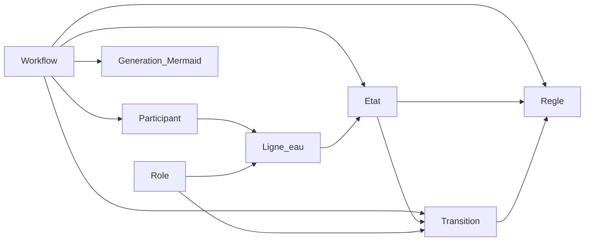

# Structure de la base de données

Cette page décrit le modèle de données utilisé pour représenter des workflows, générer des diagrammes Mermaid et documenter les états, transitions, règles et rôles associés.

Le modèle est volontairement compatible avec une base de type Grist : les tables sont simples, les identifiants sont lisibles et les relations peuvent être représentées par des références.

## Vue d'ensemble


```mermaid
flowchart LR
    Workflow[Workflow]
    Participant[Participant]
    LigneEau[Ligne_eau]
    Etat[Etat]
    Transition[Transition]
    Role[Role]
    Regle[Regle]
    Generation[Generation_Mermaid]

    Workflow --> Participant
    Participant --> LigneEau
    Workflow --> Etat
    Workflow --> Transition
    Workflow --> Regle
    Workflow --> Generation
    LigneEau --> Etat
    Etat --> Transition
    Role --> Transition
    Role --> LigneEau
    Etat --> Regle
    Transition --> Regle
```

## Table `Workflow`

La table `Workflow` décrit un processus métier ou un circuit de suivi.

| Champ | Type | Obligatoire | Description |
|---|---|---:|---|
| `workflow_id` | texte | oui | Identifiant stable du workflow. |
| `nom` | texte | oui | Nom lisible du workflow. |
| `description` | texte long | non | Description fonctionnelle du workflow. |
| `type_diagramme` | choix | oui | Type de génération Mermaid : `swimlane`, `flowchart` ou `stateDiagram`. |
| `orientation` | choix | non | Orientation Mermaid : `TB`, `TD`, `LR`, `BT`, `RL`. |
| `actif` | booléen | oui | Indique si le workflow est utilisable. |

## Table `Participant`

La table `Participant` représente un acteur ou une organisation propriétaire
d'une ou plusieurs lignes d'eau. Dans les diagrammes Mermaid `swimlane-beta`,
le participant n'est pas généré comme un sous-graphe imbriqué et son nom n'est
pas préfixé au libellé du couloir.

| Champ | Type | Obligatoire | Description |
|---|---|---:|---|
| `participant_id` | texte | oui | Identifiant stable du participant/pool. |
| `workflow_id` | référence `Workflow` | oui | Workflow auquel appartient le participant. |
| `nom` | texte | oui | Libellé affiché sur le pool. |
| `description` | texte long | non | Rôle du participant dans la collaboration. |
| `processus_visible` | booléen | oui | Indique si le processus interne du pool est affiché. |
| `ordre` | nombre | non | Ordre de présentation des pools. |

## Table `Ligne_eau`

La table `Ligne_eau` représente une partition de responsabilité. Lorsqu'un
workflow contient des lignes d'eau, chaque ligne d'eau devient un couloir
Mermaid `swimlane-beta` de premier niveau. Elle classe les nœuds par rôle,
entité, système ou autre critère homogène ; elle ne représente pas une phase du
processus.

| Champ | Type | Obligatoire | Description |
|---|---|---:|---|
| `ligne_eau_id` | texte | oui | Identifiant stable et compatible Mermaid. |
| `workflow_id` | référence `Workflow` | oui | Workflow auquel appartient la ligne d'eau. |
| `participant_id` | référence `Participant` | oui | Participant propriétaire de la ligne d'eau. |
| `nom` | texte | oui | Rôle, entité ou système affiché sur le couloir. |
| `description` | texte long | non | Responsabilité couverte par la partition. |
| `type_partition` | choix | oui | `role`, `entite`, `systeme` ou `autre`. |
| `role_id` | référence `Role` | non | Rôle métier représenté, lorsqu'il existe dans le référentiel. |
| `ordre` | nombre | non | Ordre de présentation des lignes d'eau. |
| `couleur` | texte | non | Indication de style éventuelle pour l'interface. |

## Table `Etat`

La table `Etat` décrit les états possibles d'un workflow.

| Champ | Type | Obligatoire | Description |
|---|---|---:|---|
| `etat_id` | texte | oui | Identifiant stable et compatible Mermaid. |
| `workflow_id` | référence `Workflow` | oui | Workflow auquel appartient l'état. |
| `ligne_eau_id` | référence `Ligne_eau` | non | Ligne d'eau dans laquelle présenter l'état. |
| `nom` | texte | oui | Libellé affiché dans les vues. |
| `description` | texte long | non | Champ historique lu en repli ; ne plus l'utiliser dans les nouvelles données. |
| `type_etat` | choix | oui | `initial`, `normal`, `validation`, `blocage`, `final`. |
| `ordre` | nombre | non | Ordre de présentation. |
| `contenu` | texte long | non | Texte canonique de l'état. |
| `type_contenu` | choix | non | Format du texte : `markdown`, `html`, `texte`. |
| `couleur` | texte | non | Indication de style éventuelle pour Mermaid ou l'interface. |
| `type_lien` | choix | non | Nature du lien : `page_phase`, `page_etat` ou `url`. |
| `cible_lien` | texte | non | Destination du lien portée par l'état. |
| `libelle_lien` | texte | non | Libellé accessible décrivant la navigation. |

## Table `Transition`

La table `Transition` porte la logique principale du workflow.

| Champ | Type | Obligatoire | Description |
|---|---|---:|---|
| `transition_id` | texte | oui | Identifiant stable de la transition. |
| `workflow_id` | référence `Workflow` | oui | Workflow concerné. |
| `etat_source_id` | référence `Etat` | oui | État de départ. |
| `etat_cible_id` | référence `Etat` | oui | État d'arrivée. |
| `libelle` | texte | oui | Libellé affiché sur la transition Mermaid. |
| `condition` | texte long | non | Condition métier nécessaire au passage d'état. |
| `role_autorise` | référence `Role` | non | Rôle habilité à déclencher la transition. |
| `action_associee` | texte long | non | Action attendue lors de la transition. |
| `contenu` | texte long | non | Documentation associée à la transition. |
| `type_contenu` | choix | non | `markdown`, `html`, `texte`. |
| `type_lien` | choix | non | Nature du lien : `page_phase`, `page_etat` ou `url`. |
| `cible_lien` | texte | non | Page interne ou URL associée à la transition. |
| `libelle_lien` | texte | non | Libellé accessible décrivant la navigation. |
| `type_flux_bpmn` | choix | non | `sequence` par défaut, ou `message` entre deux pools. |
| `actif` | booléen | oui | Indique si la transition est utilisable. |

## Table `Role`

La table `Role` décrit les acteurs qui interviennent dans le workflow.

| Champ | Type | Obligatoire | Description |
|---|---|---:|---|
| `role_id` | texte | oui | Identifiant stable du rôle. |
| `nom` | texte | oui | Nom du rôle. |
| `description` | texte long | non | Responsabilités générales. |
| `contenu` | texte long | non | Guide ou consignes associées au rôle. |
| `type_contenu` | choix | non | `markdown`, `html`, `texte`. |

## Table `Regle`

La table `Regle` décrit les contrôles applicables aux états ou transitions.

| Champ | Type | Obligatoire | Description |
|---|---|---:|---|
| `regle_id` | texte | oui | Identifiant stable de la règle. |
| `workflow_id` | référence `Workflow` | oui | Workflow concerné. |
| `transition_id` | référence `Transition` | non | Transition concernée. |
| `etat_id` | référence `Etat` | non | État concerné. |
| `nom` | texte | oui | Nom lisible de la règle. |
| `expression` | texte long | non | Expression lisible, pseudo-code ou formule. |
| `message_erreur` | texte long | non | Message affiché si la règle échoue. |
| `bloquante` | booléen | oui | Indique si l'échec de la règle bloque la transition. |

## Table `Generation_Mermaid`

La table `Generation_Mermaid` conserve les représentations Mermaid générées à partir du modèle.

| Champ | Type | Obligatoire | Description |
|---|---|---:|---|
| `generation_id` | texte | oui | Identifiant de génération. |
| `workflow_id` | référence `Workflow` | oui | Workflow représenté. |
| `type_diagramme` | choix | oui | `swimlane`, `flowchart`, `stateDiagram`, ou autre extension future. |
| `code_mermaid` | texte long | oui | Code Mermaid généré. |
| `date_generation` | date/heure | oui | Date de génération. |
| `version` | texte | non | Version du modèle ou de la génération. |

## Contraintes de cohérence

- Un `Etat` appartient à un seul `Workflow`.
- Une `Ligne_eau` appartient à un seul `Workflow`.
- Une `Ligne_eau` appartient au pool d'un `Participant` du même workflow.
- La ligne d'eau associée à un état doit appartenir au même workflow.
- Un état peut rester sans ligne d'eau ; il est alors affiché dans le couloir
  `Sans ligne d’eau`.
- Un flux de séquence peut traverser plusieurs lignes d'eau d'un même pool, mais pas
  la frontière du pool.
- Un flux de message relie deux pools distincts et ne doit pas relier deux
  nœuds du même pool.
- Une `Transition` relie deux états du même `Workflow`.
- Une `Transition` inactive ne doit pas être générée dans les diagrammes destinés aux utilisateurs.
- Une `Regle` peut être attachée à un état, à une transition, ou aux deux.
- Le champ `type_contenu` doit indiquer comment interpréter le champ `contenu` : Markdown, HTML ou texte brut.
- Les identifiants utilisés dans Mermaid doivent éviter les espaces, accents et caractères spéciaux.
- Un lien interne `page_phase` doit cibler `phases/<identifiant>.html`.
- La valeur historique `page_etat` reste admise par le schéma, mais sa
  destination est signalée comme invalide par l'éditeur : le site ne génère
  plus de page individuelle `states/*.html`.
- Un lien de type `url` doit utiliser HTTP ou HTTPS.
- `type_lien` et `cible_lien` doivent être renseignés ensemble.
- Les liens structurés des états et transitions sont présentés avec leur
  validité dans `etats.html` et `transitions.html`.
- Une destination interne absente reste exportable mais est signalée comme
  invalide et n'est pas rendue cliquable.

## Workflow directeur et phases

Un site peut distinguer deux workflows dans le même jeu de données :

- un workflow directeur contenant uniquement les grandes phases ;
- un workflow détaillé contenant les états opérationnels des pages de phase.

Le manifeste les désigne dans sa section `site` :

```json
{
  "site": {
    "overview_workflow_id": "Phases_projet_informatique",
    "detail_workflow_id": "Projet_informatique",
    "diagram": {
      "node_spacing": 20,
      "rank_spacing": 20,
      "diagram_padding": 16,
      "wrapping_width": 180,
      "lane_title_wrap": 18,
      "use_max_width": false
    }
  }
}
```

`site.diagram` règle la mise en page Mermaid sans modifier les données métier.
Les quatre premières dimensions sont exprimées en pixels. Pour un `flowchart`
orienté `LR`, `rank_spacing` correspond à l'écart horizontal entre les étapes.
Mermaid 11.17.2 accepte aussi ce réglage pour `swimlane-beta`, mais son moteur
de placement ne le répercute pas encore sur la distance horizontale observée.
`lane_title_wrap` est un nombre de caractères : un titre plus long est coupé
une seule fois, au séparateur de mots le plus proche du milieu ; `0` désactive
la coupure. `use_max_width: false` conserve la largeur naturelle calculée à
partir du contenu et laisse le panneau proposer un défilement horizontal.

Les états du workflow directeur utilisent `type_lien = page_phase`. Les états
terminaux des diagrammes détaillés utilisent le même mécanisme pour conduire à
la phase suivante.

## Compatibilité entre le modèle et les données

`schema/workflow-model.json` est la définition de référence. Les fichiers de
données ne peuvent employer que les tables et champs déclarés dans ce modèle.
Ils doivent respecter les types, champs obligatoires, choix et références
définis par le schéma.

Cette compatibilité est obligatoire dans les deux sens :

- une évolution du modèle doit maintenir ou migrer les jeux de données ;
- une évolution des données doit rester conforme au modèle courant.

Le contrôle est automatisé par `scripts/validate_workflow_data.py` et par les
tests du répertoire `tests`. Une modification du modèle ou des données ne doit
pas être intégrée si ces contrôles échouent.

## Jeux de données fragmentés

Un workflow volumineux peut être réparti dans plusieurs fichiers JSON. Chaque
fragment contient un sous-ensemble des tables et enregistrements du modèle. Un
manifeste ordonne leur assemblage :

```json
{
  "format": "workflow-data-manifest-v1",
  "schema": "../../../schema/workflow-model.json",
  "files": [
    "00-referentiel.json",
    "01-cadrage-budgetisation.json"
  ]
}
```

Règles du format :

- les chemins `schema` et `files` sont relatifs au manifeste ;
- chaque clé d'un fragment doit être une table du modèle ;
- chaque valeur associée à une table doit être une liste d'enregistrements ;
- une table peut être répartie entre plusieurs fragments ;
- les identifiants doivent être uniques après assemblage ;
- les références peuvent cibler un enregistrement d'un autre fragment ;
- le jeu assemblé doit contenir toutes les tables du modèle, même si certaines
  restent vides.

Le jeu de travail `data/workflows/projet-informatique/manifest.json` illustre
ce format.

## Catalogue de workflows

`data/workflows/catalog.json` référence les manifestes publiés dans un même
site. Ce catalogue ne modifie pas le modèle Grist : il organise seulement la
publication statique.

Chaque entrée définit :

- un `slug` unique utilisé comme répertoire ;
- le chemin du `manifest` ;
- un `label` affiché à l'utilisateur ;
- une `description` facultative.
