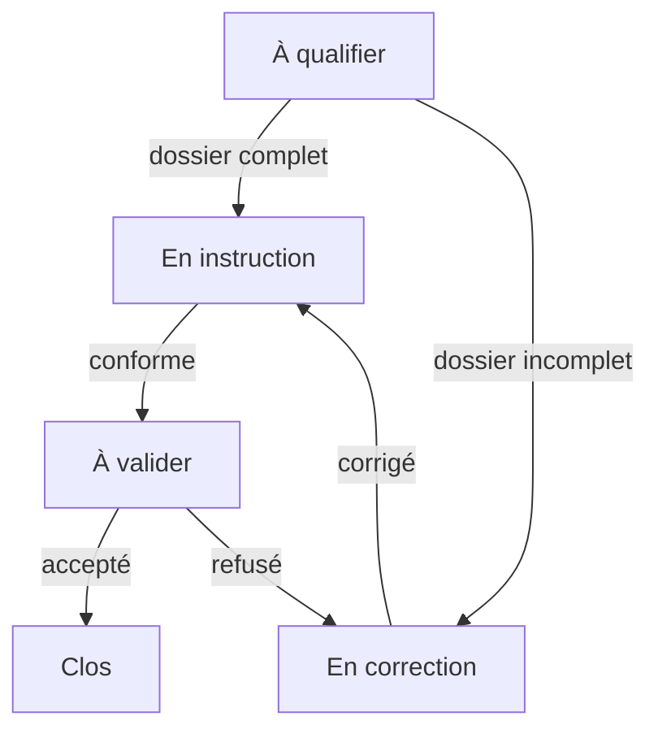
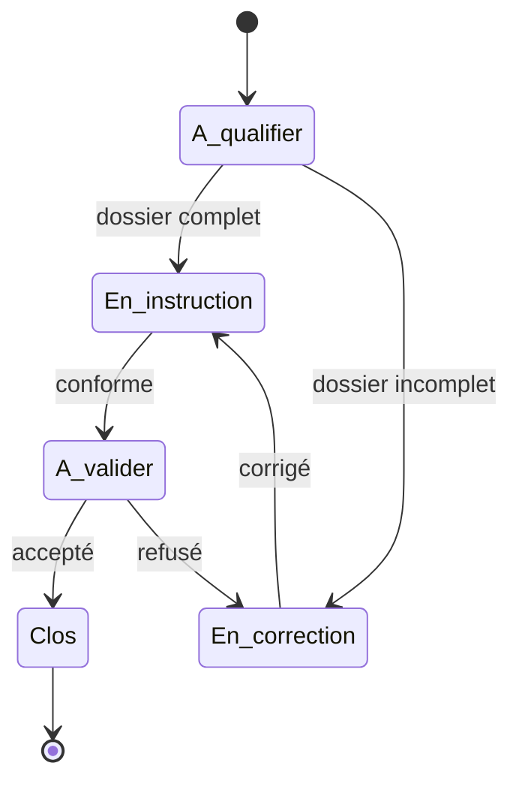
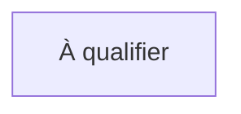
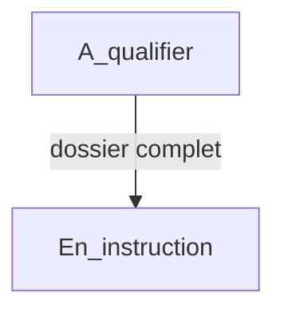
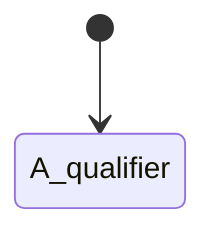
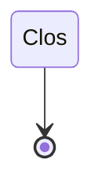
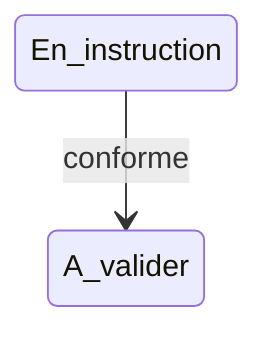
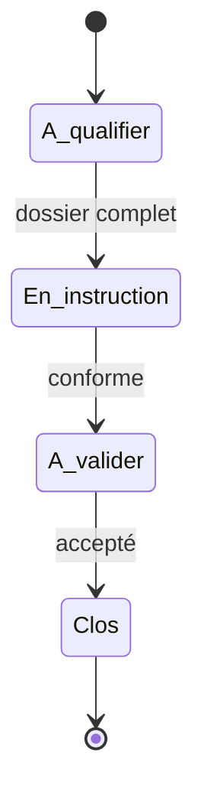
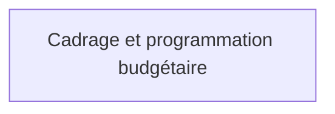

# Représentations Mermaid

Cette page montre comment les données du modèle peuvent être transformées en diagrammes Mermaid.

Deux représentations sont prévues :

- `flowchart` pour représenter le cheminement global d'un processus ;
- `stateDiagram-v2` pour représenter les états et transitions d'un objet suivi.

## Représentation en graphe de processus

Le graphe de processus est utile pour expliquer le circuit général d'un workflow à des utilisateurs métier.



## Représentation en diagramme d'états

Le diagramme d'états est utile pour vérifier la cohérence du cycle de vie d'un objet suivi.



## Règle de génération d'un `flowchart`

Chaque état devient un noeud Mermaid.

Exemple :

```text
Etat.etat_id = A_qualifier
Etat.nom = À qualifier
```

Résultat :



Chaque transition devient une flèche.

Exemple :

```text
Transition.etat_source_id = A_qualifier
Transition.etat_cible_id = En_instruction
Transition.libelle = dossier complet
```

Résultat :



## Règle de génération d'un `stateDiagram-v2`

Les états de type `initial` doivent être reliés depuis `[*]`.



Les états de type `final` doivent pouvoir pointer vers `[*]`.



Les transitions normales sont représentées par une flèche avec libellé.



## Utilisation dans MediaWiki

Une page MediaWiki peut intégrer le code Mermaid généré afin de documenter visuellement le workflow.

Exemple de bloc à publier :

````text

````

## Générateur Python

Le script `scripts/generate_mermaid.py` ne dépend que de la bibliothèque
standard Python. Il accepte deux formats JSON :

- le schéma `schema/workflow-model.json` ;
- un export de données organisé par tables, comme
  `examples/workflow-data.json` ;
- un manifeste de données fragmentées, comme
  `data/workflows/projet-informatique/manifest.json`.

Exécution avec le jeu de données d'exemple :

```powershell
py scripts/generate_mermaid.py examples/workflow-data.json
```

Exécution avec le schéma :

```powershell
py scripts/generate_mermaid.py schema/workflow-model.json
```

Exécution avec un workflow fragmenté :

```powershell
py scripts/generate_mermaid.py `
  data/workflows/projet-informatique/manifest.json `
  --output projet-informatique.md
```

La sortie par défaut contient les deux diagrammes dans des blocs
` ```mermaid ` compatibles avec la publication dans MediaWiki. Les principales
options sont :

| Option | Valeurs | Effet |
|---|---|---|
| `--diagram` | `flowchart`, `state`, `both` | Sélectionne le ou les diagrammes. |
| `--format` | `markdown`, `code` | Produit des blocs Markdown ou du code Mermaid brut. |
| `--workflow-id` | identifiant | Sélectionne un workflow quand plusieurs workflows actifs sont présents. |
| `--output` | chemin | Écrit le résultat dans un fichier au lieu de la sortie standard. |

Exemple de génération ciblée :

```powershell
py scripts/generate_mermaid.py examples/workflow-data.json `
  --workflow-id Suivi_dossier `
  --diagram state `
  --output suivi-dossier.md
```

### Format d'un jeu de données

Le document JSON doit contenir au minimum les clés `Workflow`, `Etat` et
`Transition`, chacune associée à une liste d'enregistrements. Les noms de
champs correspondent aux tables décrites dans `docs/database-structure.md`.

Lorsqu'un manifeste `workflow-data-manifest-v1` est fourni, le générateur
assemble les fragments dans l'ordre déclaré avant d'appliquer ces règles. La
compatibilité complète avec le modèle doit être vérifiée séparément avec
`scripts/validate_workflow_data.py`.

Le générateur applique les règles suivantes :

- sans `--workflow-id`, un seul workflow actif doit être présent ;
- seuls les états du workflow sélectionné sont générés ;
- seules ses transitions dont `actif` vaut `true` sont générées ;
- les identifiants sont validés et doivent être compatibles Mermaid ;
- une transition qui référence un état absent du workflow provoque une erreur ;
- l'orientation du `flowchart` vient de `Workflow.orientation`, avec `TD` par
  défaut ;
- les états sont ordonnés par `Etat.ordre`, puis par identifiant ;
- les états `initial` et `final` sont reliés à `[*]` dans le
  `stateDiagram-v2`.

Les libellés sont échappés pour éviter qu'un guillemet, une barre verticale,
un retour à la ligne ou un deux-points ne casse la syntaxe Mermaid.

### Génération depuis le schéma

Le fichier `schema/workflow-model.json` décrit la structure du modèle, mais ne
contient aucune instance de workflow. Dans ce mode, les deux sorties sont donc
des vues **structurelles** :

- chaque table devient un noeud ou un état ;
- chaque champ de type `reference` devient une relation étiquetée ;
- le `flowchart` utilise l'orientation `LR`.

Le `stateDiagram-v2` structurel ne représente pas un cycle de vie métier. Pour
obtenir les états initiaux, finaux et les transitions réelles, il faut utiliser
un jeu de données tel que `examples/workflow-data.json`.

## Intégration dans les sorties HTML

Les générateurs décrits dans `docs/html-site-generation.md` réutilisent les
mêmes fonctions de génération Mermaid. Le code produit est placé dans un
élément `pre.mermaid`, puis rendu côté navigateur avec Mermaid en mode de
sécurité `loose`, nécessaire pour rendre les noeuds cliquables. Les cibles sont
validées avant génération et le HTML métier est filtré indépendamment.

Dans le site statique, seul le `flowchart` est actuellement affiché. Le
diagramme général des phases est intégré directement à `index.html`.
`assets/app.js` est volontairement un script classique
chargé avec `defer`. Il utilise ensuite `import()` pour récupérer Mermaid. Il
ne doit pas être converti en script local `type="module"`, car cette forme est
bloquée par plusieurs navigateurs lors d'une ouverture directe en `file://`.

### Liens dans les noeuds

Lorsqu'un état définit `type_lien` et `cible_lien`, le flowchart ajoute une
instruction Mermaid `click` :



Le site adapte les chemins relatifs selon que le diagramme se trouve à la
racine ou dans le répertoire `phases`.

Les workflows publiés par `data/workflows/catalog.json` définissent
`Workflow.orientation = LR` afin d'afficher les phases et états
horizontalement, de gauche à droite.

Une modification des règles Mermaid doit donc être vérifiée dans les trois
sorties :

- Markdown ou MediaWiki via `generate_mermaid.py` ;
- page HTML unique via `generate_workflow_html.py` ;
- site statique via `generate_workflow_site.py`.

## Bonnes pratiques

- Utiliser des identifiants Mermaid sans espaces ni accents.
- Conserver les libellés métier dans le champ `nom` ou `libelle`.
- Générer uniquement les transitions actives dans les vues destinées aux utilisateurs.
- Vérifier que chaque état final est atteignable.
- Vérifier qu'aucun état normal n'est isolé.
- Documenter les conditions et rôles associés aux transitions.
