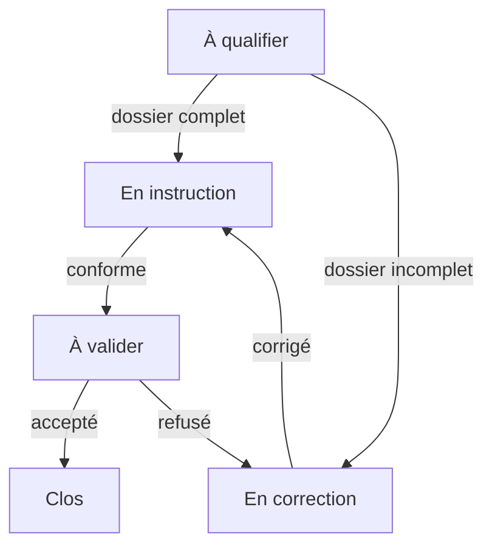
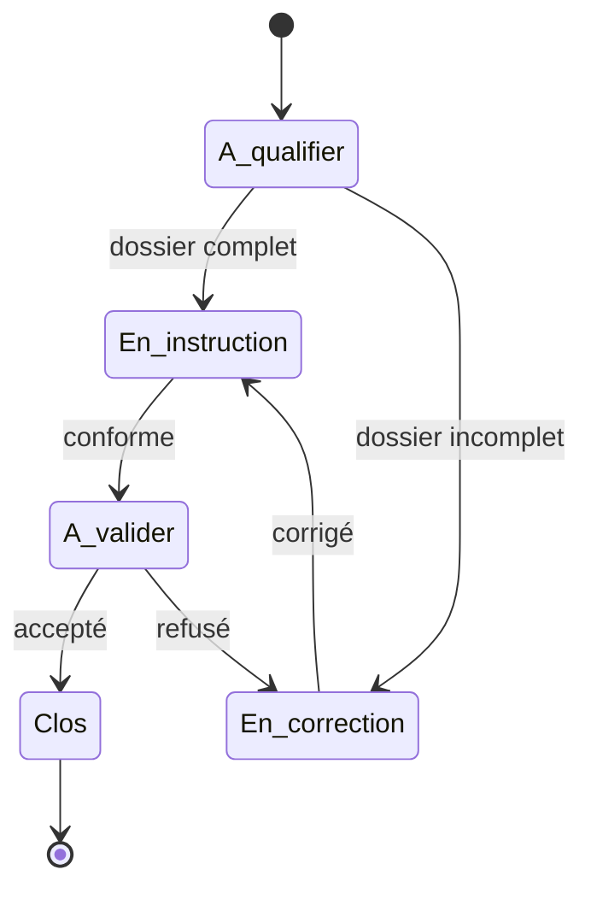
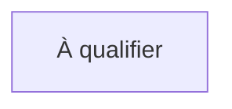
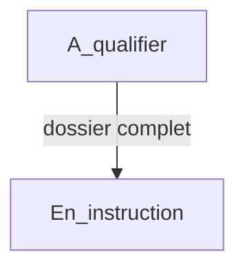
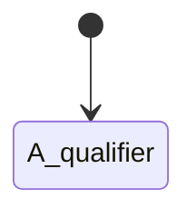
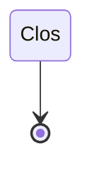
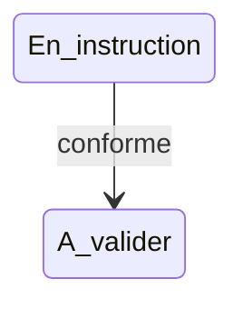
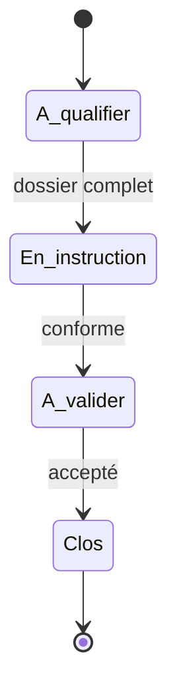

# Représentations Mermaid

Cette page montre comment les données du modèle peuvent être transformées en diagrammes Mermaid.

Deux représentations sont prévues :

- `flowchart` pour représenter le cheminement global d'un processus ;
- `stateDiagram-v2` pour représenter les états et transitions d'un objet suivi.

## Représentation en graphe de processus

Le graphe de processus est utile pour expliquer le circuit général d'un workflow à des utilisateurs métier.



## Représentation en diagramme d'états

Le diagramme d'états est utile pour vérifier la cohérence du cycle de vie d'un objet suivi.



## Règle de génération d'un `flowchart`

Chaque état devient un noeud Mermaid.

Exemple :

```text
Etat.etat_id = A_qualifier
Etat.nom = À qualifier
```

Résultat :



Chaque transition devient une flèche.

Exemple :

```text
Transition.etat_source_id = A_qualifier
Transition.etat_cible_id = En_instruction
Transition.libelle = dossier complet
```

Résultat :



## Règle de génération d'un `stateDiagram-v2`

Les états de type `initial` doivent être reliés depuis `[*]`.



Les états de type `final` doivent pouvoir pointer vers `[*]`.



Les transitions normales sont représentées par une flèche avec libellé.



## Utilisation dans MediaWiki

Une page MediaWiki peut intégrer le code Mermaid généré afin de documenter visuellement le workflow.

Exemple de bloc à publier :

````text

````

## Bonnes pratiques

- Utiliser des identifiants Mermaid sans espaces ni accents.
- Conserver les libellés métier dans le champ `nom` ou `libelle`.
- Générer uniquement les transitions actives dans les vues destinées aux utilisateurs.
- Vérifier que chaque état final est atteignable.
- Vérifier qu'aucun état normal n'est isolé.
- Documenter les conditions et rôles associés aux transitions.
